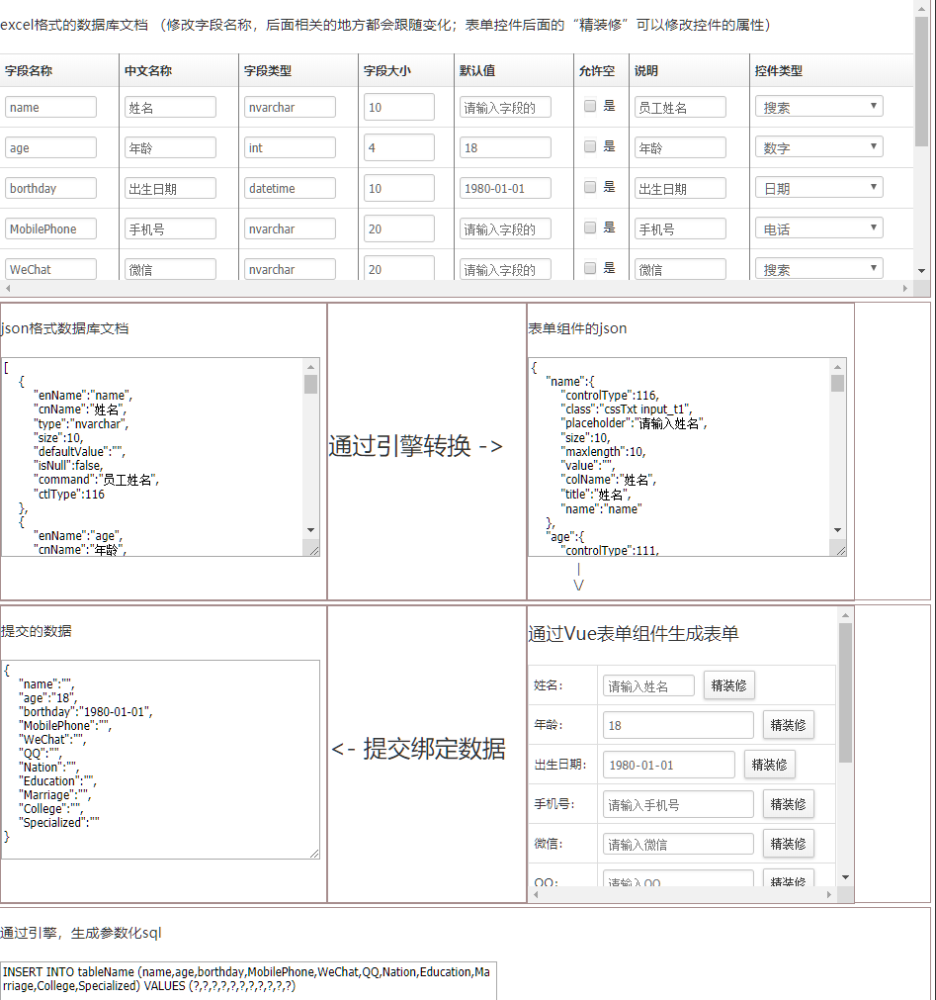

# 文档驱动的思路介绍

> 这里只是介绍一下思路，真实项目里面并不是完全这么做的。  

## 开场白

>甲用Excel做了一个数据库文档，做完之后感觉挺好的。
乙看了之后，感觉做成json格式的似乎更好一些，于是改了改。
丙看了修改后的json后发现，这个不是和那个Vue的表单组件需要的json很像吗？于是又改了改。
丁看到这些后感觉，既然前端都可以这么做了，那么后端是不是也可以……于是也改了改。
甲、乙、丙、丁看到最后的效果后非常满意——这下终于不用996了！于是向老板请功。
老板看后大喜：太好了，你们可以回家休息了！
甲乙丙丁：……

到底发生了什么？带我慢慢分解。

## 思路
　　由数据库文档出发，引出各种json，利用引擎、组件等实现基本的增删改查的功能！最后可以做的**“文档在手，天下我有”**的效果。基本思路就是下面这个脑图。


## 在线演示

<https://naturefw.github.io/RealProject/Demo/Doc01/index.html>


## 源码地址

<https://github.com/naturefw/RealProject/tree/master/Demo/Doc01>

## 实现步骤
1. excel 格式的文档。
2. json格式的文档。（由引擎生成）
3. Vue表单组件需要的json。（由引擎生成）
4. 改善表单组件的json。（需手动）
5. 绑定表单。（Vue组件）
6. 提交数据。
7. 后端自动拼接SQL。（由引擎生成）

## 优点
1. 增加一套增删改查，不需要增加代码，只需要增加json即可——json可以自动生成。
2. 需求变更后，只需要修改文档，文档变化后，可以自动修改各级json。不用改动代码即可应对需求的变更。（本来也没有代码呀）
3. 依赖注入，整个增删改查可以依据json完成，不需要copy代码。（还不是没有代码的原因？）
4. 可以减少出bug的机会。（都不需要代码了，还怎么有bug？）
5. 减少工作量，增加工作效率。（同上）
6. 支持权限、角色。（这个转折有点突然吧，怎么冒出来的？）

## 缺点
1. 灵活性有所限制。
2. 特殊需要需要使用插件的方式实现。
3. 不可能适应任何场景，这不是银弹。（还是先声明一下，省着有人多想）

## 详细介绍

### 数据库文档
　　做一个项目，数据库文档是一个最基本的文档了，即便其他的可以省略，但是数据库文档是必选项！专业的数据库设计应该采用PowerDesigner，只是他设计的数据库文档，不方便用程序读取，所以这里采用了Excel的形式。  
　　Excel便于操作和使用，也可以方便的使用代码来读取内容，这样就灵活多了。比如下面这个样子。
【Excel格式的数据库文档】


### 页面效果

看着控件挺多的吧，其实html部分只需要两个循环就可以搞定。
```html
<h5>excel格式的数据库文档</h5>
<table rules="all" class="table_default1">
    <tr>
        <th>字段名称</th>
        <th>中文名称</th>
        <th>字段类型</th>
        <th>字段大小</th>
        <th>默认值</th>
        <th>允许空</th>
        <th>说明</th>
        <th>控件类型</th>
        
    </tr>
    <tr v-for="tr in dataExcel.info">
        <td v-for="td in dataExcel.orderby">
            <my-input :meta="dataExcel.ctlExcelMeta[td]" v-model="tr[td]" :value="tr[td]" ></my-input>
        </td>
    </tr>
</table>
```

　　这里使用了Vue的表单组件，控件属性描述由meta绑定。这样模板部分会非常简洁。只需要设置好json就可以了。  

　　“控件类型”并不属于数据库文档的部分，这里只是为了便于演示，所以加上了。我们可以修改表格里的字段名称和中文名称，后面的json、表单、提交的数据、生成的SQL都会跟随改变。即第二个优点的体现。  

### json格式的数据库文档
　　虽然代码可以读取Excel，但是在使用的时候开始有些不太方便，为了更方便我们改用json的形式。先做一个简单的转化。如下图。

【json格式的数据库文档】
```javascript
var dataDocInfo = [
    {
        enName:"name",
        cnName:"姓名",
        type:"nvarchar",
        size:10,
        defaultValue:"",
        isNull:false,
        command:"员工姓名",
        ctlType:116
    },
    {
        enName:"age",
        cnName:"年龄",
        type:"int",
        size:4,
        defaultValue:"18",
        isNull:false,
        command:"年龄",
        ctlType:111
    },
    {
        enName:"borthday",
        cnName:"出生日期",
        type:"datetime",
        size:10,
        defaultValue:"1980-01-01",
        isNull:false,
        command:"出生日期",
        ctlType:103
    }
    //其他略
]
```

　　然后我们可以依据这个json来做很多事情，比如生成建表的SQL语句，生成增删改查的SQL语句。还可以对数据做类型检测，比如是不是int。

### 生成表单组件需要的json
　　我们可以做一个简单的引擎，把文档的json变成组件需要的json，只需要设置几个主要属性即可，这样可以形成一个“清水房”的效果。可以先实现基本功能。然后在通过“精装修”的方法做细节调整。
```javascript
{
    "name":{
        "controlType":"101",
        "class":"cssTxt input_t1",
        "placeholder":"请输入姓名",
        "size":10,
        "maxlength":10,
        "value":"",
        "colName":"姓名",
        "title":"姓名",
        "name":"name"
    }
    //其他略
}
```

### 表单的展示
　　表单组件需要json来描述，我们依据数据库文档，可以生成初步的json，这个json可以称为“清水房”，然后我们可以对其进行“精装修”，生成更漂亮的表单。这样就有了一定的灵活性，另外也可以去掉不需要的字段，以及增加需要的字段。

精装修，设置详细属性


### 生成表单数据


### 后端
　　依据json和客户端提交的数据，可以进行验证，通过验证后可以生成增删改查的SQL语句，然后提交给数据库。这样后端的基本功能就可以实现出来了。  


### FAQ

1. 数据验证怎么办？
>数据验证分为前端验证和后端验证，前端验证注重与用户的交互，重点在于方便用户录入正确的数据。后端关注的是安全性，分为两大部分，一个是数据类型和范围是否匹配，一个是是否符合业务逻辑的要求。 

>如果后端采用node的话，那么前后端的验证基本可以使用同一套代码来实现，如果后端不是node，那么也可以围绕正则来实现判断。  

>前端的数据类型可以由组件来实现，比如日期组件，给出的数据都是日期格式，我们来验证一下业务逻辑即可。  

>后端就要更严格，必须对前端提交的数据进行严格的验证，这个可以根据文档里的字段类型来判断。业务逻辑可以依赖正则来判断。

2. 不能重复的判断
>这个就需要后端提供一个接口，先向后端询问是否重复，然后在给用户一个友好的提示。

3. 控件的联动怎么办？
>以前是加各种事件来实现，现在Vue的思路是数据绑定，那么是不是可以对数据进行监控来实现呢？

4. 第三方组件、控件怎么办？
>第三方的组件众多，能不能兼容就要一个一个来测试了。
