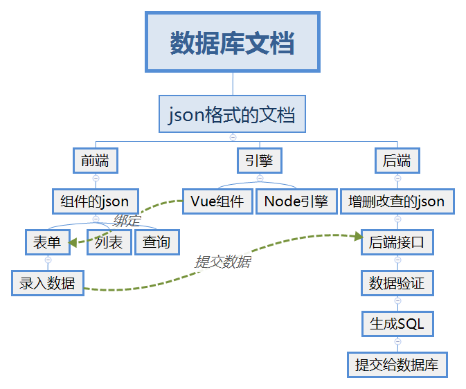

# 文档驱动的思路介绍

> 这里只是介绍一下思路，真实项目里面并不是完全这么做的。  

## 步骤
1. excel 格式的文档。
2. json格式的文档。
3. Vue表单组件需要的json。
4. 改善表单组件的json。
5. 绑定表单。
6. 提交数据。
7. 后端自动拼接SQL。

## 优点
1. 增加一套增删改查，不用增加代码，只需要增加json即可，json可以自动生成。
2. 文档变化后，可以自动修改各级json。不用改动代码即可应对需求的变更。
3. 依赖注入，整个增删改查可以依据json完成，不需要copy代码。
4. 可以减少出bug的机会。

## 缺点
1. 灵活性有所限制。
2. 特殊需要需要使用插件的方式实现。

## 图示
【脑图】

## 详细介绍

### 数据库文档
做一个项目，数据库文档是一个最基本的文档了，其他的省就省了，这个是必选项。专业的数据库设计应该采用PowerDesigner，只是他设计的数据库，不方便用程序读取，所以这里采用了Excel的形式。  
Excel便于操作和使用，也可以方便的使用代码来读取内容，这样就灵活多了。比如下面这个样子。
【Excel格式的数据库文档】

### json格式
虽然代码可以读取Excel，但是在使用的时候开始有些不太方便，为了更方便我们改用json的形式。先做一个简单的转化。如下图。

【json格式的数据库文档】

然后我们可以依据这个json来做很多事情，比如生成建表的SQL语句，生成增删改查的SQL语句。还可以对数据做类型检测，比如是不是int。

### 表单组件
表单组件需要json来描述，我们依据数据库文档，可以生成初步的json，这个json可以称为“清水房”，然后我们可以对其进行“精装修”，生成更漂亮的表单。这样就有了一定的灵活性，另外也可以去掉不需要的字段，以及增加需要的字段。

### 后端
依据json和客户端提交的数据，可以进行验证，通过验证后可以生成增删改查的SQL语句，然后提交给数据库。这样后端的基本功能就可以实现出来了。  

## 在线演示

### 数据库文档
这里用一个大表格来标示数据库文档，为了便于演示，增加了一个“控件类型”的列，这个只是为了便于演示，实际中的数据库设计，并不需要这个列。  
我们可以直接修改字段名称，后面的相关部分都会自动更新，比如表单元素的name属性值，提交数据的key值，生成的SQL语句。  
修改控件类型，可以直接修改表单控件的类型。  
修改中文名称，表单里的名称也会自动变化。  
这样可以生成“清水房”的表单。
【图片】

### json格式
1. 修改数据库文档里面的字段名称、中文名称，可以影响json的“colname”和“name”，以及提交数据的json的key值。字段类型在初始化的时候，可以影响控件类型，后续修改就不会影响了，控件类型需要由精装修来确认。
2. 精装修可以影响json的其他属性。修改结果也是可以保存起来的。这样我们可以不断的对表单进行完善。在线演示，可以动态显示出来这些变化。（由于时间比较仓促，有点小bug）
【图片】

### 表单的精装修
依据文档自动生成的表单，只能算是“清水房”，并不能完全实现客户的需求，比如有些表单并不需要表里的所有字段，有些表单需要增加字段，有些字段对应的控件需要做调整，那么怎么办呢？就需要一个“精装修”的功能。  
我们通过“精装修”增加、移除控件，也可以对每一个控件进行精确控制，以便于更灵活的控制表单。  
还可以通过插件的形式进行特殊处理。  
【图片】

