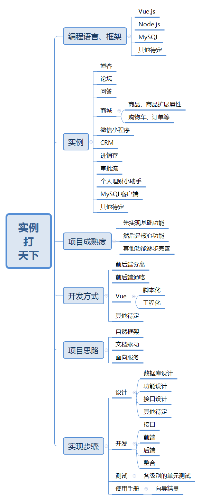

# 实例打天下系列
>以真实项目为实例，以完成项目为目标！遇到不会的知识点再去学习（带着问题更高效）。  
>项目搭台，编程语言、框架、技巧经验来演绎。打造一个全新系列！

# 总体结构

+ 以完成项目为目标，从无到有、从小到大，不断演变，不断完善。  

+ 项目包括网站类、信息管理类以及辅助工具。  

+ 前后端结合：双端合璧，打造完整项目。  

+ 从设计开始。介绍完整的项目开发流程。  

+ 代码全部开源不断完善功能。  

+ 前端采用vue，后端采用Note.js，数据库用mySQL。 

+ 开源的哦，欢迎大家一起来，众人拾柴火焰高，这么多东东我一个人要做到什么时候呀。  

# 起源
　　十多年的时间MC把漫威宇宙打造成现在的这种程度，柯南都1000多集了但是离完结还遥遥无期，斗罗大陆都出到了第4部，听说还要出第五部、第六部；全职法师还没有写完……  那么技术类的书籍为什么不能有一个大长篇呢？  

　　当然这里不是说要讲故事，如果是故事的话，估计喜欢看故事的人不会喜欢看代码，想看代码的人又不能忍受漫长的故事情节。  

　　所以这里打算用一个个真实的例子——博客、论坛、电子商城，CRM这一类的项目——为目标，完整的介绍项目的开发的各个步骤，每个步骤要如何做、如何设计、如何编写代码、如何做测试，以及当需求变更时要如何面对、如何实现变更后的需求。  

　　当然这里和做真正的项目还是有区别的，其重点呢还是放在了各种知识点的介绍方面，比如介绍Vue的使用方法等。  

# 侧重 
> 实现项目，还是介绍各种知识点？

这里有一个做项目和介绍基础知识的一个侧重点的问题。基本上是五五分吧。

当然项目不可能做得太全面，毕竟我们的目标是介绍知识点，而不是真的要做一个特别完善的博客，或者特别完善的电商平台，这个呢是没有那个实力搞定的。  

# 项目完善程度

>真的要做一个电商平台吗？  

当然不是了，像淘宝、天猫、京东这样的电商，怎么可能一个人搞定呢？  

这里只是介绍一下核心功能的一种实现方法（并不唯一，也不保证是最优的），比如说商品，商品的扩展属性，购物车订单等.  
介绍核心功能的实现方式。  
当然要把这些完全介绍清楚，需要的时间是非常非常长的，所以呢，才说要做一个大长篇。  

# 应对版本升级

另外在编写的过程中，各种技术也是在不断的进步的，比如说Vue马上就要从2.x，升级到3.0，这个时候技术会有一些变化，那么以前的使用方式是不是要做一些修改调整，以适应新的版本？这样的话，就会有不断的有新的技术增加进来，新的实践思路，新的手法不断的填充进来，所以呢，这是一个永远不会有结尾的超级大长篇。  
